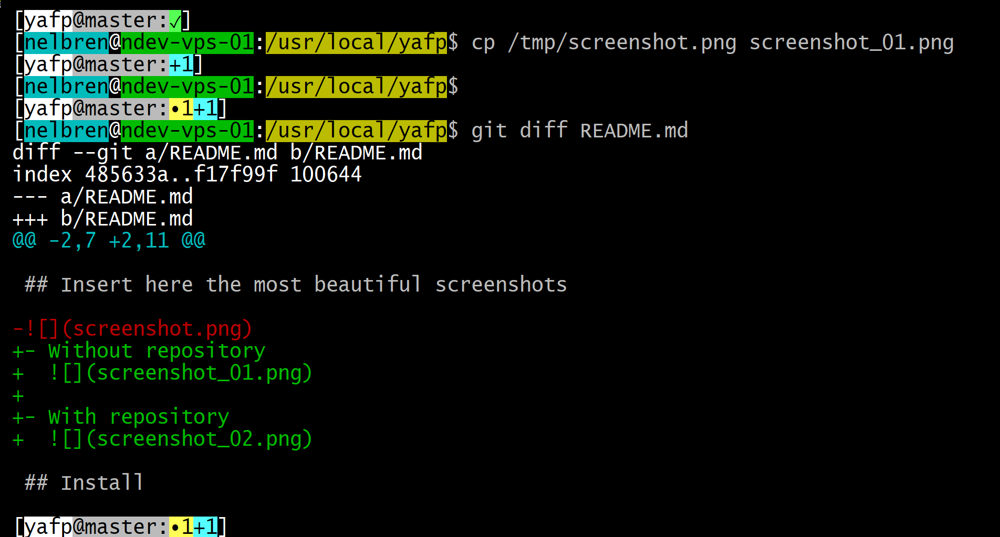
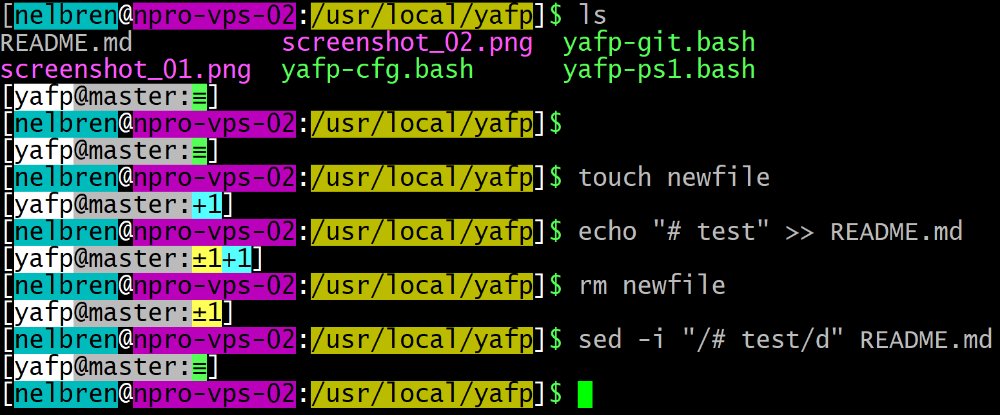

# :computer: Yet Another Fancy Prompt

[](https://www.gnu.org/software/bash/)

## :soon: Insert here the most beautiful screenshots

- :black_circle: **Without** repository

  

- :white_circle: **With** repository

  

- :large_blue_circle: With repository - **New file** and **Changes** example

  

## :art: Styles

### :bulb: Colors change according to:

- :green_book: **Developer**
  - :necktie: root (**#**)
  - :tshirt: normal user (**$**)
- :closed_book: **Production** 
  - :necktie: root (**#**)
  - :tshirt: normal user (**$**)

## :floppy_disk: Acquire

```bash
cd /usr/local
git clone https://github.com/nelbren/yafp.git
```

## :eyes: Preview

```bash
source /usr/local/yafp/yafp-ps1.bash
```

## :heavy_check_mark: Install

```bash
echo "source /usr/local/yafp/yafp-ps1.bash" | tee -a ~/.bashrc /etc/skel/.bashrc
```
