# :computer: Yet Another Fancy Prompt

[](https://www.gnu.org/software/bash/) [](https://docs.microsoft.com/powershell/)  

## :soon: Insert here the most beautiful screenshots

### :apple: macOS

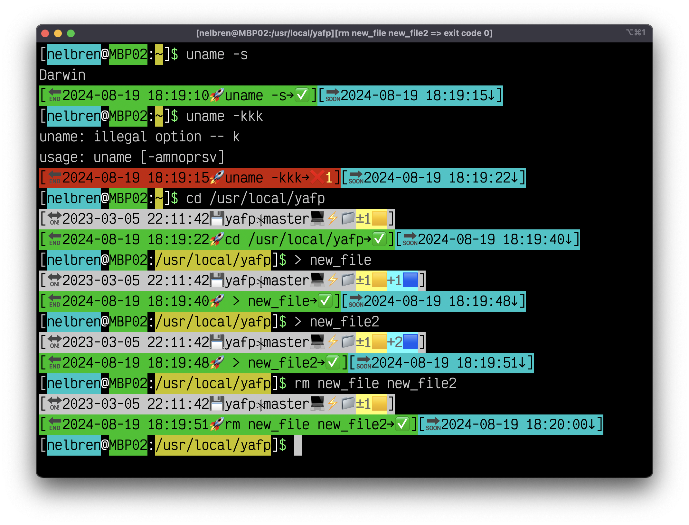

### :window: [Cygwin](https://www.cygwin.com/)

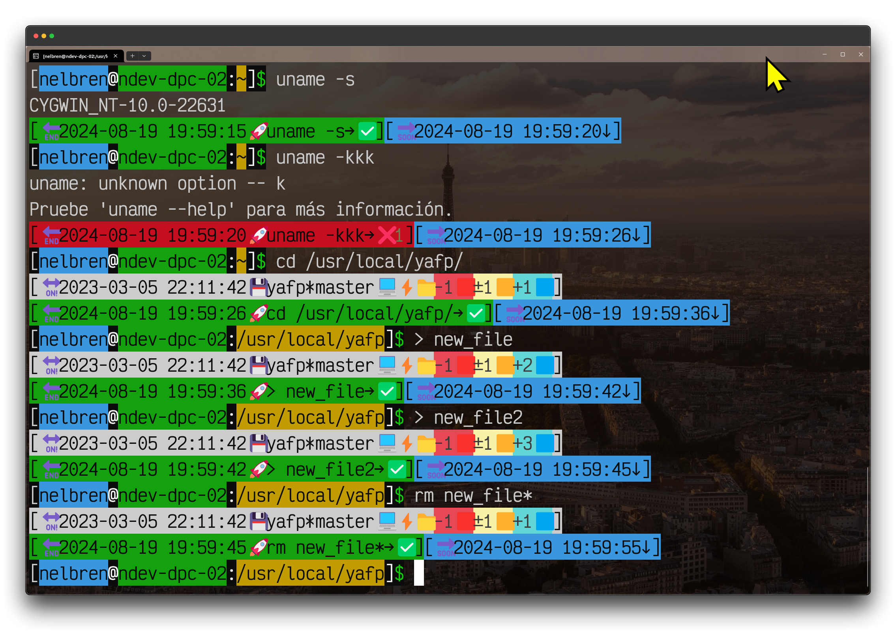

### :window: [Git Bash](https://git-scm.com/download/win)

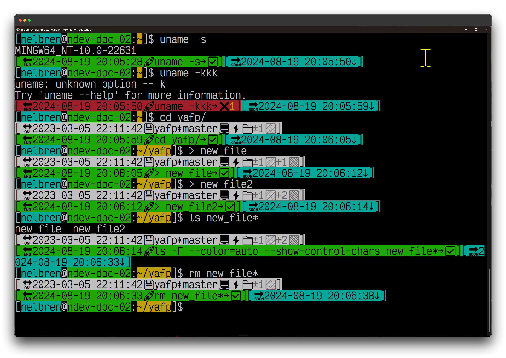

### :penguin: Linux

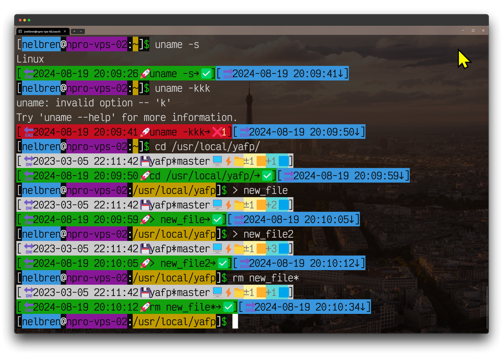

### :window: [PowerShell](https://learn.microsoft.com/es-es/powershell/scripting/install/installing-powershell-on-windows?view=powershell-7.5)

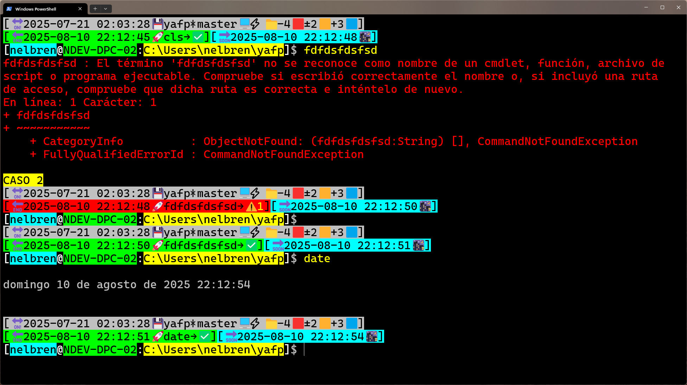

---

## :art: Styles

### :bulb: Colors change according to

#### :computer: Server type

- ##### :green_book: **Developer**

- ##### :closed_book: **Production**

#### :bust_in_silhouette: User type

- ##### :necktie: root (**`#`**)

- ##### :tshirt: normal user (**`$`**)

---

## I. :floppy_disk: Acquire

### 👤 Local acquire

#### ⌨ Commands to acquire local

```bash
cd
git clone https://github.com/nelbren/yafp.git
```

#### 👁️ Example of acquire local

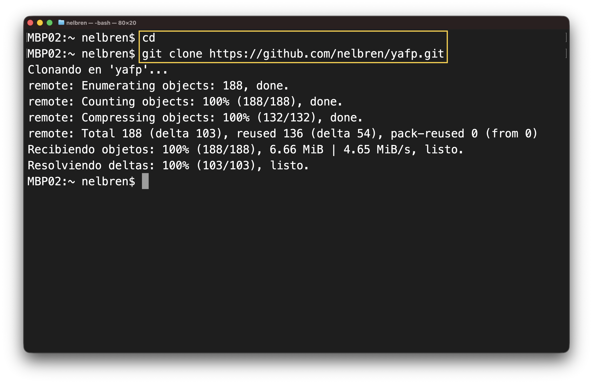

### 🌐 Global acquire

#### ⌨ Commands to acquire globally

```bash
sudo su -
cd /usr/local
git clone https://github.com/nelbren/yafp.git
```

#### 👁️ Example of acquire globally

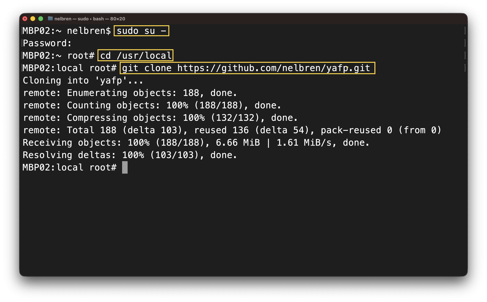

## II :gear: Configure

### 👤 Local settings

#### ⌨ Commands to configure locally

```bash
cd ~/yafp
cp yafp-cfg.bash.example yafp-cfg.bash
```

#### 👁️ Example of local configuration

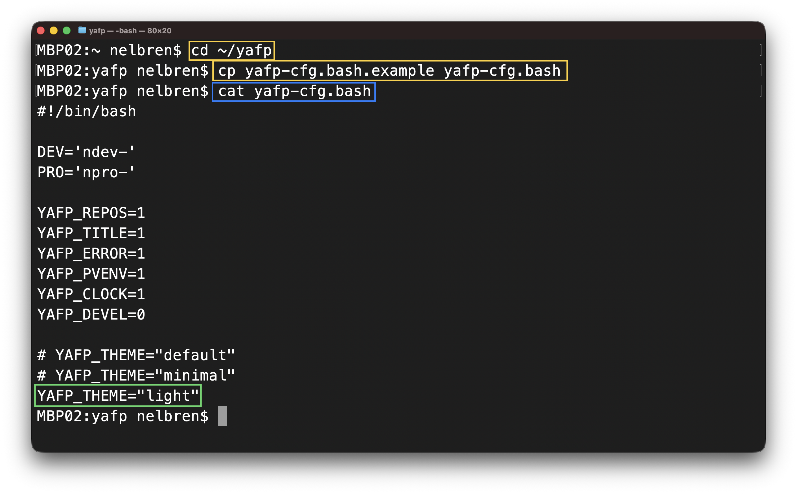

### 🌐 Global settings

#### ⌨ Commands to configure globally

```bash
cd /usr/local/yafp
cp yafp-cfg.bash.example yafp-cfg.bash
```

#### 👁️ Example of global configuration

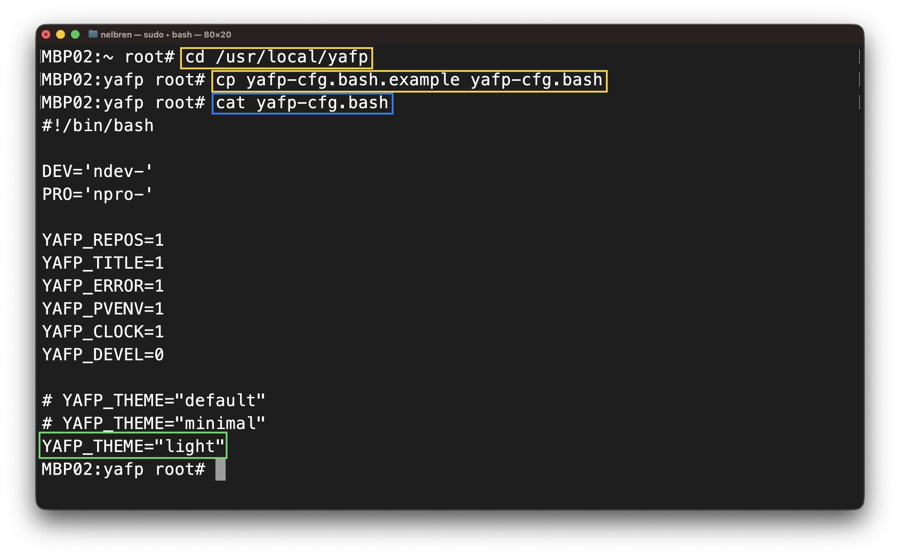

## III. :eyes: Preview

### 👤 Local preview

#### ⌨ Commands for local preview

```bash
source ~/yafp/yafp-ps1.bash
```

#### 👁️ Example of local preview

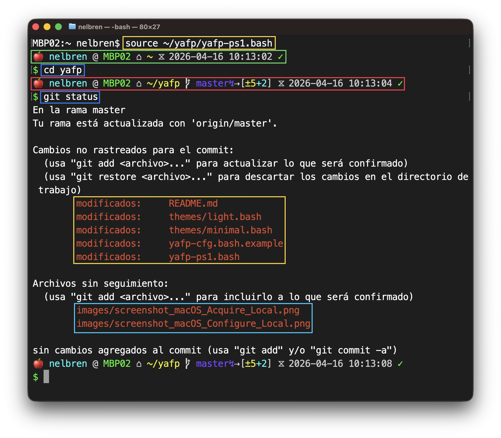

### 🌐 Global preview

#### ⌨ Commands for global preview

```bash
source /usr/local/yafp/yafp-ps1.bash
```

#### 👁️ Example of global preview

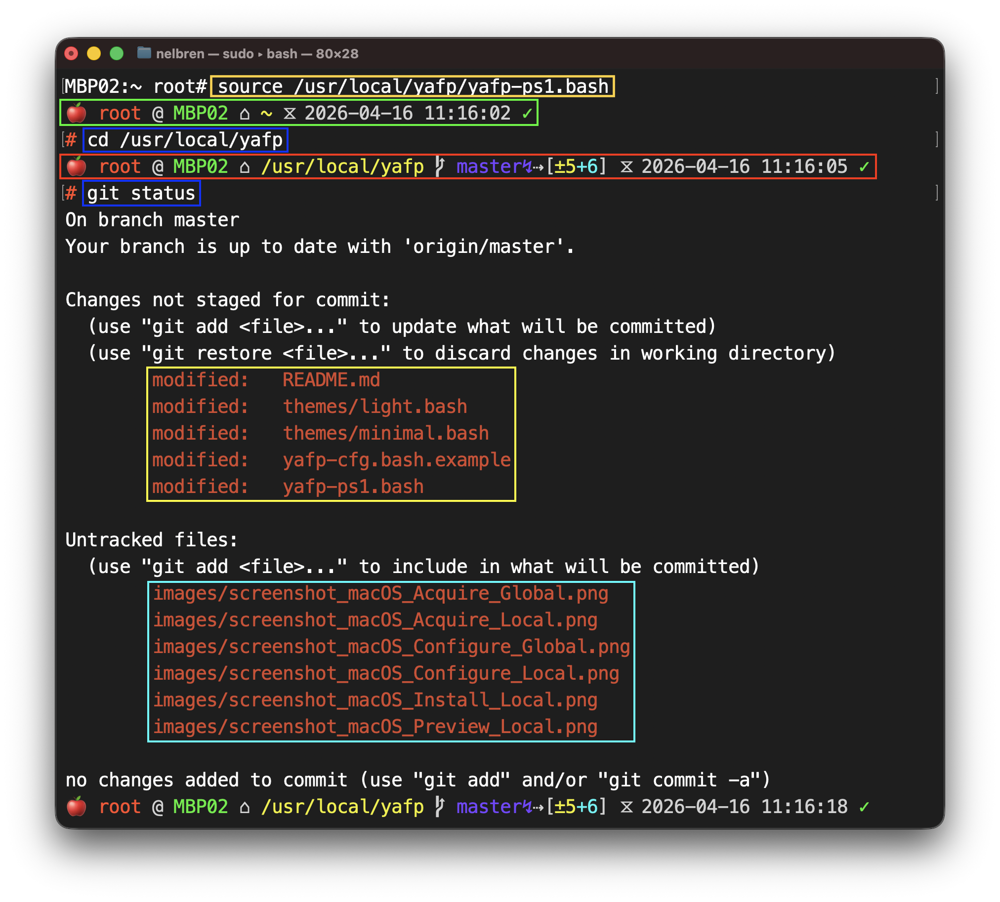

## IV. :heavy_check_mark: Install

### 👤 Local install

#### ⌨ Commands for local install

```bash
echo source ~/yafp/yafp-ps1.bash >> ~/.bash_profile 
```

#### 👁️ Example of local install

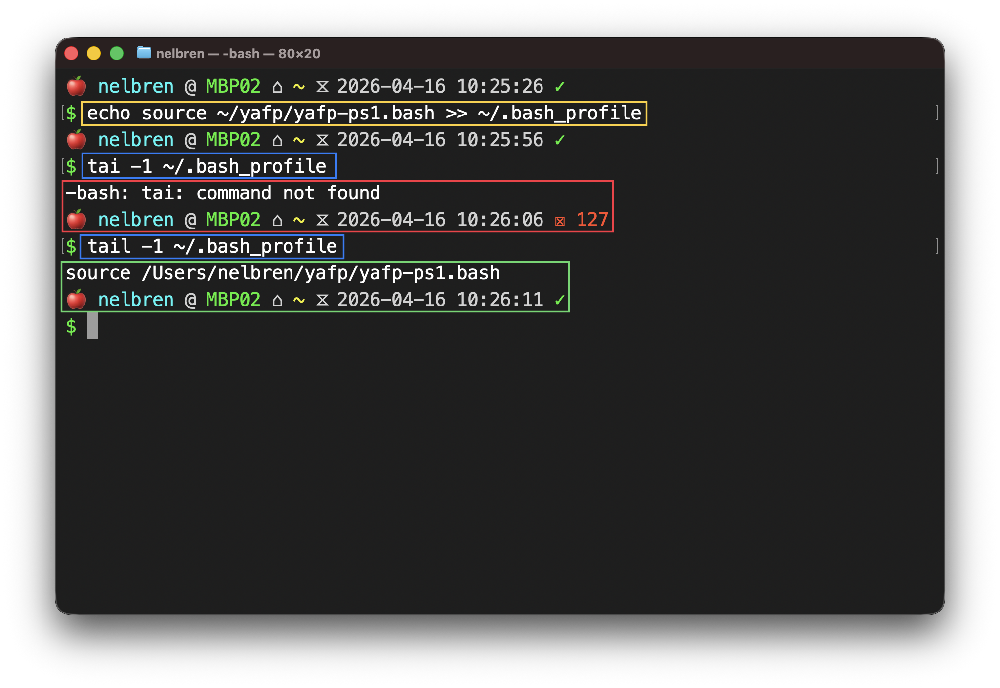

### 🌐 Global install

#### ⌨ Commands for global installation

```bash
echo source /usr/local/yafp/yafp-ps1.bash >> ~/.bash_profile 
```

#### 👁️ Example of global installation

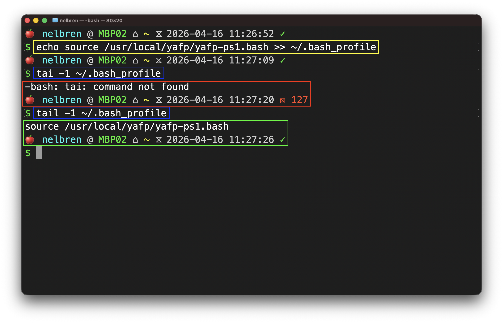
