# :computer: Yet Another Fancy Prompt

[![made-with-bash][badge-bash]][bash]
[![made-with-powershell][badge-powershell]][powershell]
![version][badge-version]
![themes][badge-themes]

[badge-bash]: https://img.shields.io/badge/Made%20with-Bash-1f425f.svg
[badge-powershell]: https://img.shields.io/badge/Made%20with-PowerShell-5391FE.svg?logo=powershell
[badge-version]: https://img.shields.io/badge/version-0.3.1-green
[badge-themes]: https://img.shields.io/badge/themes-8A2BE2?logo=educative
[bash]: https://www.gnu.org/software/bash/
[powershell]: https://docs.microsoft.com/powershell/

## :soon: Insert here the most beautiful screenshots

### :apple: [macOS](https://www.apple.com/la/os/macos/)

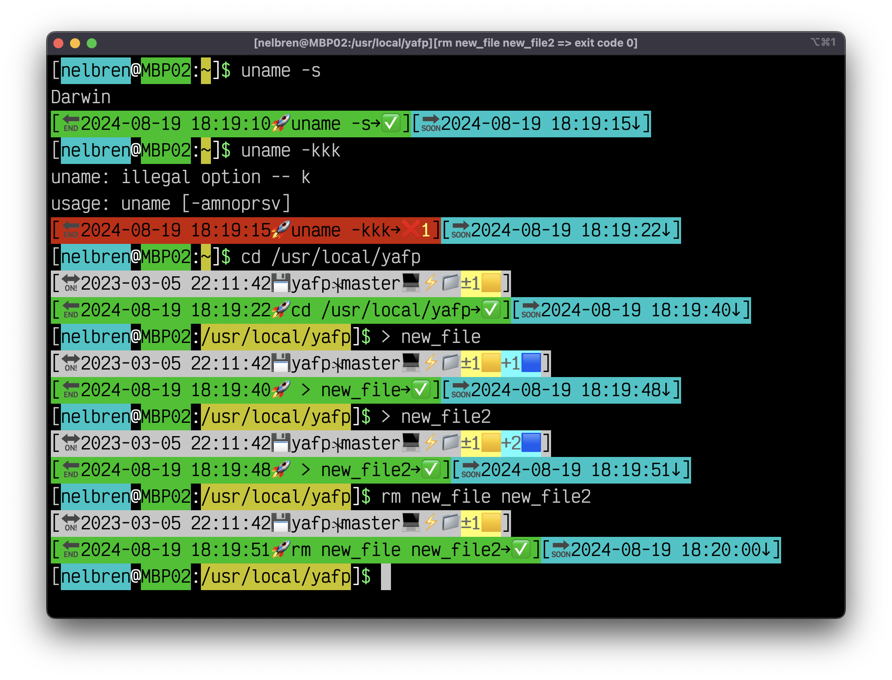

### :window: [Cygwin](https://www.cygwin.com/)

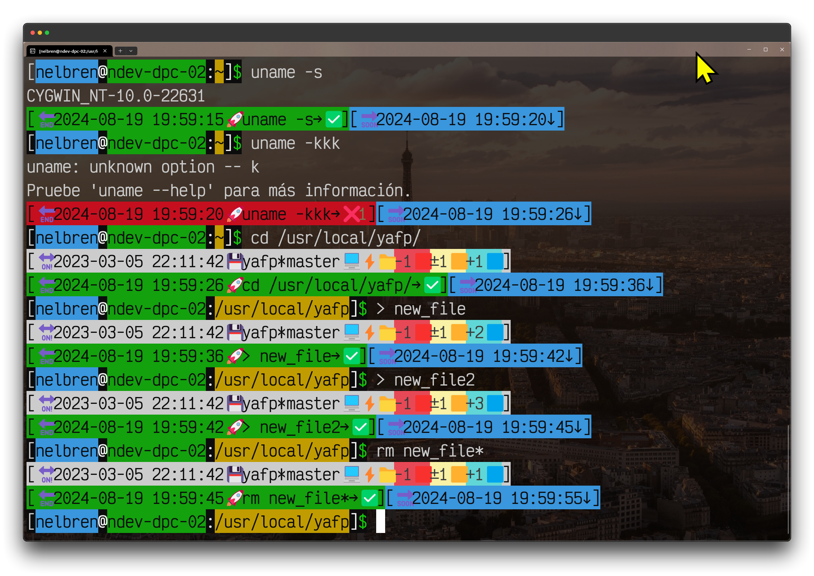

### :window: [Git Bash](https://git-scm.com/download/win)

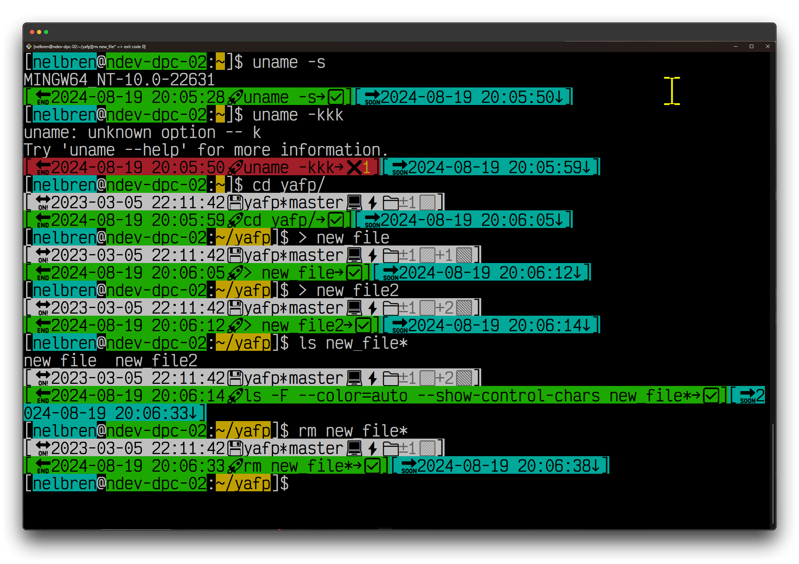

### :penguin: Linux

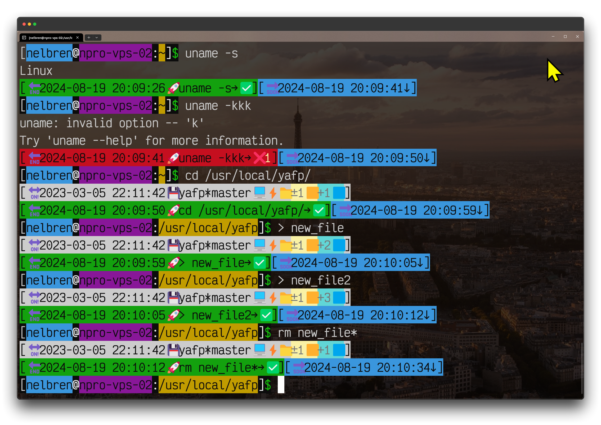

### :window: [PowerShell](https://learn.microsoft.com/es-es/powershell/scripting/install/installing-powershell-on-windows?view=powershell-7.5)

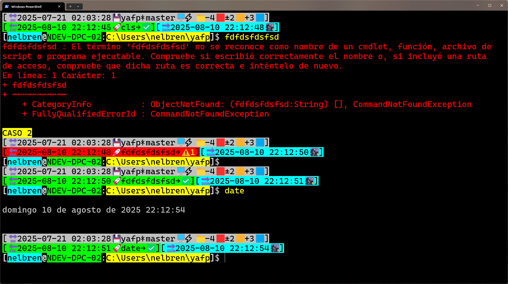

---

## :art: Styles

### :bulb: Colors change according to

#### :computer: Server type

- ##### :green_book: **Developer**

- ##### :closed_book: **Production**

#### :bust_in_silhouette: User type

- ##### :necktie: root (**`#`**)

- ##### :tshirt: normal user (**`$`**)

### :window: PowerShell themes

PowerShell now supports the `default`, `minimal`, and `light` themes. Select
one in `yafp-cfg.ps1` before loading `yafp-ps.ps1`:

```powershell
$global:YAFP_THEME = 'minimal'
```

If the selected theme does not exist, YAFP falls back to the `default` theme.

Set `YAFP_DARKC` to `1` to use darker background variants in the Bash and
PowerShell `default` and `minimal` themes. Set it to `0` for brighter
backgrounds:

```bash
YAFP_DARKC=1
```

```powershell
$global:YAFP_DARKC = 1
```

The option does not affect `light`, which renders without colored backgrounds.

### Git repository identity

In the Bash `default` theme, only the repository name uses the same yellow
highlight as its directory representation in PowerShell. The surrounding Git
symbols and metadata keep the Git block color.

The origin symbol distinguishes repositories by configuration:

| Symbol | Themes               | Meaning                                |
| ------ | -------------------- | -------------------------------------- |
| `↯`    | `light`              | The repository has a configured remote |
| `⚡`   | `default`, `minimal` | The repository has a configured remote |
| `⇣`    | All                  | The repository has no `origin` remote  |

The `light` and `minimal` themes render the branch name in blue in both Bash
and PowerShell, including when a remote countdown or status precedes it. In
`light`, the adjacent repository-origin symbol keeps the neutral color.

### Clock display

Set `YAFP_CLOCK` to `1` to display prompt timestamps or to `0` to hide them.
The option applies to every Bash and PowerShell theme.

For Bash, set the value in `yafp-cfg.bash`:

```bash
YAFP_CLOCK=1
```

For PowerShell, set the value in `yafp-cfg.ps1`:

```powershell
$global:YAFP_CLOCK = 1
```

### Development timing

Set `YAFP_DEVEL` to `1` to display the prompt construction time. A value of `0`
or an unset variable disables it. It works with every Bash and PowerShell theme.

For Bash, set the value in `yafp-cfg.bash`:

```bash
YAFP_DEVEL=1
```

For PowerShell, set the value in `yafp-cfg.ps1`:

```powershell
$global:YAFP_DEVEL = 1
```

The diagnostic line uses the same fields on both shells:

| Field     | Meaning                                      |
| --------- | -------------------------------------------- |
| `Total`   | Total prompt construction time               |
| `General` | General context time                         |
| `Git`     | Git context time                             |
| `Venv`    | Python virtual environment context time      |
| `Error`   | Previous command status calculation time     |
| `Timer`   | Remaining timer and orchestration overhead   |

The output maps those fields to `Total ms | ⚙️General 🌱Git 🐍Venv ❌Error
⚡Timer`.

Totals below 50 ms use `🚀` in green, totals from 50 through 199 ms use
`⏱️` in yellow, and totals of 200 ms or more use `🐢` in red.

### Remote repository checks

YAFP can periodically refresh the configured upstream without blocking the
prompt. Configure the cache lifetime in seconds before loading the prompt:

| Value             | Behavior                                      |
| ----------------- | --------------------------------------------- |
| `0`               | Disables remote checks completely             |
| Positive integer  | Enables checks using that interval in seconds |
| Not configured    | Defaults to 300 seconds                       |

For Bash, set the value in `yafp-cfg.bash`:

```bash
YAFP_REMOTE_CHECK_INTERVAL=300
```

For PowerShell, set the value in `yafp-cfg.ps1`:

```powershell
$global:YAFP_REMOTE_CHECK_INTERVAL = 300
```

When the cached result expires, YAFP starts a non-interactive `git fetch` in
the background. A later prompt render reads the result. Repositories without
an upstream do not produce a false outdated warning.

The first prompt rendered inside a repository after YAFP loads always requests
an immediate background refresh, even when a previous cache is still fresh.
Starting outside a repository preserves that initial check until the first
repository prompt. Rendering remains non-blocking.

#### Remote status indicators

The refresh countdown and compact indicator appear immediately to the right
of the branch symbol and to the left of the branch name:

| Indicator | Color       | State and meaning                              |
| --------- | ----------- | ---------------------------------------------- |
| `(N)`     | Dark gray   | Countdown: `N` seconds until the next check    |
| `✓`       | Green       | Current: local matches its upstream            |
| `⇡N`      | Green       | Ahead: `N` local commits are ready to push     |
| `…`       | Yellow      | Checking: the first check is still running     |
| `⟳`       | Yellow      | Refreshing: updating the previous cached state |
| `⇣N`      | Intense red | Behind: `N` remote commits must be integrated  |
| `⇡N⇣M`    | Intense red | Diverged: both histories have unique commits   |
| `!`       | Intense red | Error: the remote check failed                 |

The `⟳` indicator can precede the last known state while YAFP refreshes it,
for example `⟳✓` or `⟳⇣2`. Behind and diverged states retain the prominent red
warning banner. An ahead state adds a yellow banner surrounded by `⚠️` to make
clear that local commits have not yet been pushed to the configured upstream.

For example, ` (250) ⇡1 master` means that the local branch is one commit
ahead and the next remote check will run in 250 seconds. When the countdown
reaches zero, the display can temporarily become ` (0) ⟳⇡1 master` while the
background refresh completes.

A successful `git push`, `git fetch`, or `git pull` bypasses the remaining
countdown and requests an immediate background refresh. The prompt temporarily
shows `(0) ⟳` with the last known state; after the worker completes, the next
prompt displays the new state and restarts the configured countdown. Failed
commands and incidental text such as `echo "git push"` do not reset it. This
behavior is also disabled when `YAFP_REMOTE_CHECK_INTERVAL` is `0`.

---

## I. :floppy_disk: Acquire

### 👤 Local acquire

#### ⌨ Commands to acquire local

```bash
cd
git clone https://github.com/nelbren/yafp.git
```

#### 👁️ Example of acquire local

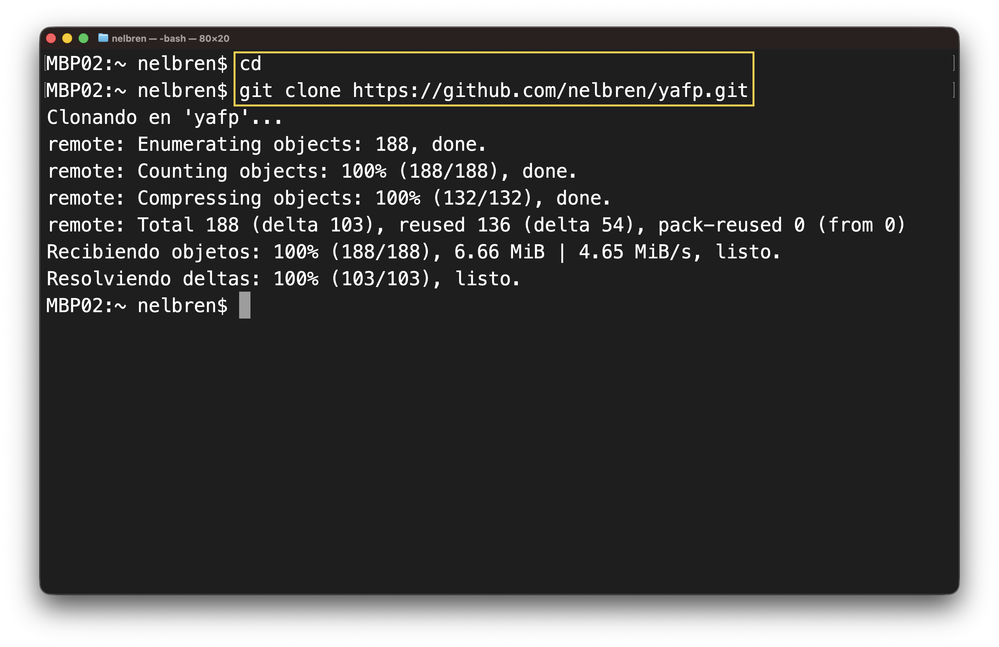

### 🌐 Global acquire

#### ⌨ Commands to acquire globally

```bash
sudo su -
cd /usr/local
git clone https://github.com/nelbren/yafp.git
```

#### 👁️ Example of acquire globally

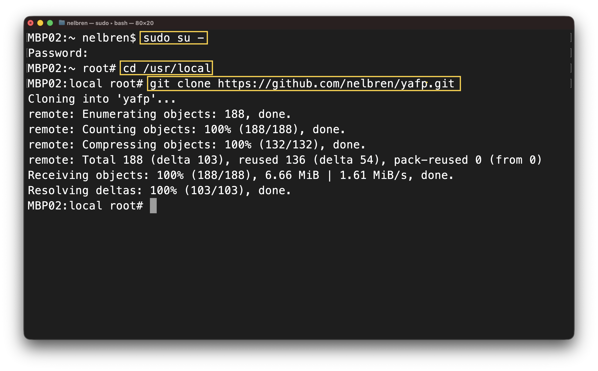

## II :gear: Configure

### 👤 Local Bash settings

#### ⌨ Commands to configure locally

```bash
cd ~/yafp
cp yafp-cfg.bash.example yafp-cfg.bash
```

#### 👁️ Example of local configuration

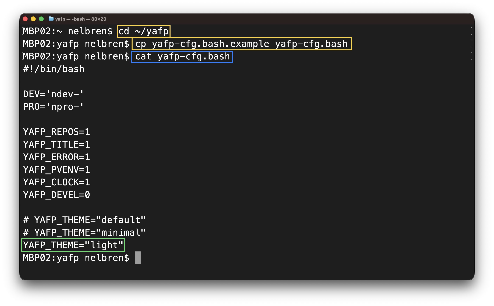

### 🪟 Local PowerShell settings

Create the personal configuration before loading the prompt:

```powershell
Copy-Item yafp-cfg.ps1.example yafp-cfg.ps1
```

Both `yafp-cfg.bash` and `yafp-cfg.ps1` are ignored by Git. Their `.example`
files define the versioned defaults and can be copied again when new options
are introduced.

### 🌐 Global settings

#### ⌨ Commands to configure globally

```bash
cd /usr/local/yafp
cp yafp-cfg.bash.example yafp-cfg.bash
```

#### 👁️ Example of global configuration

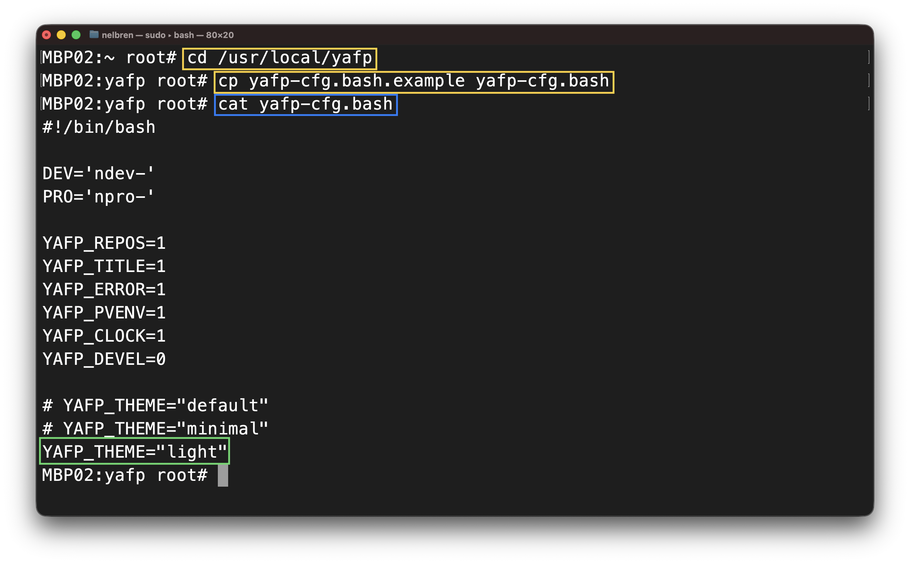

## III. :eyes: Preview

### 👤 Local preview

#### ⌨ Commands for local preview

```bash
source ~/yafp/yafp-ps1.bash
```

#### 👁️ Example of local preview

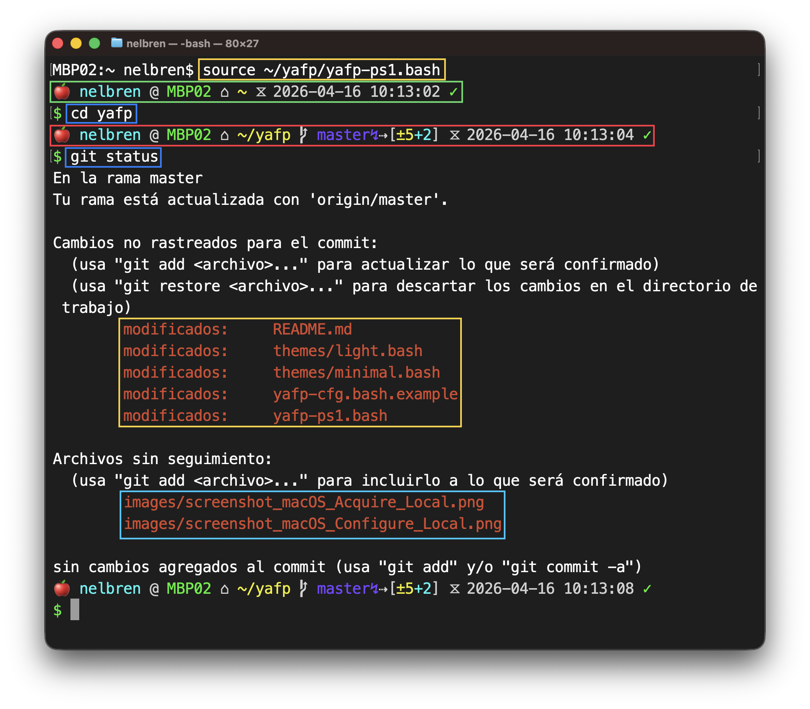

### 🌐 Global preview

#### ⌨ Commands for global preview

```bash
source /usr/local/yafp/yafp-ps1.bash
```

#### 👁️ Example of global preview

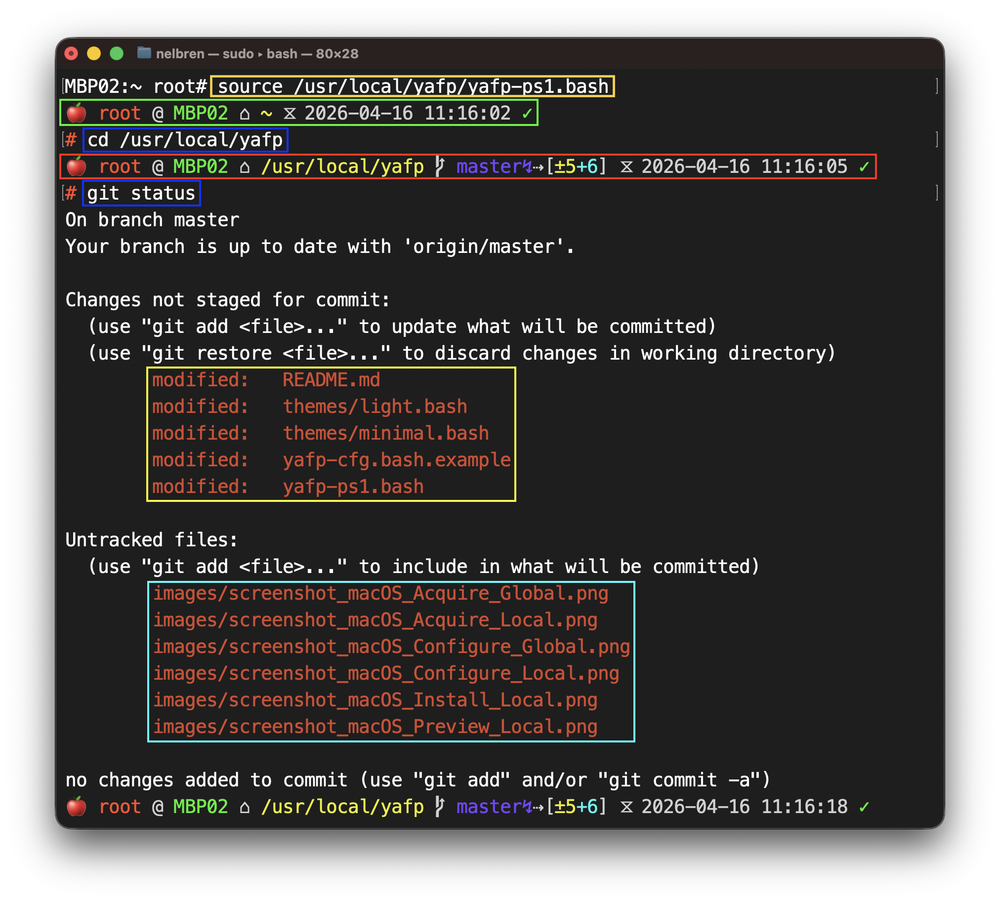

## IV. :heavy_check_mark: Install

### 👤 Local install

#### ⌨ Commands for local install

```bash
echo source ~/yafp/yafp-ps1.bash >> ~/.bash_profile 
```

#### 👁️ Example of local install

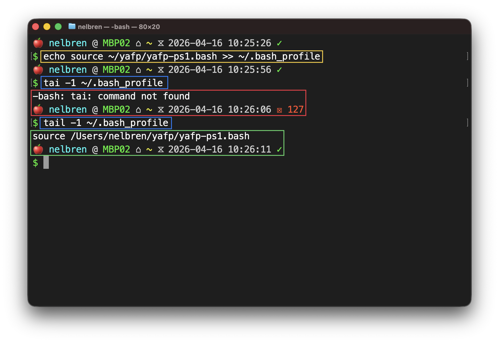

### 🌐 Global install

#### ⌨ Commands for global installation

```bash
echo source /usr/local/yafp/yafp-ps1.bash >> ~/.bash_profile 
```

#### 👁️ Example of global installation

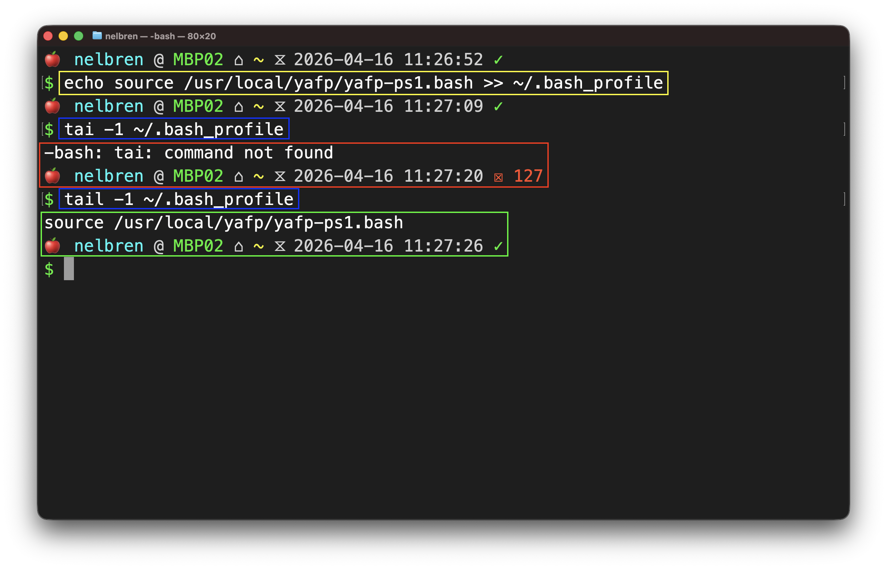

## V. Semantic command blocks with OSC 133

YAFP is a Bash/PowerShell prompt project. It does not own the pseudo-terminal,
ANSI parser, terminal renderer, or visible scrollback buffer. For terminals that
understand shell integration markers, both prompts emit OSC 133 sequences so
commands can be identified as semantic blocks:

```text
OSC 133 ; A  prompt start
OSC 133 ; B  prompt end / user input start
OSC 133 ; C  command start / output start
OSC 133 ; D  command finished, with exit code
```

For Windows Terminal and iTerm2 setup, including scrollbar marks and navigation
shortcuts, see [`OSC133.md`](docs/OSC133.md).

This is enabled by default in both configuration templates:

```bash
YAFP_OSC133=1
```

```powershell
$global:YAFP_OSC133 = 1
```

Set it to `0` if your terminal does not handle OSC 133 correctly:

```bash
YAFP_OSC133=0
```

```powershell
$global:YAFP_OSC133 = 0
```

YAFP preserves the visible prompt behavior when OSC 133 is disabled. When it is
enabled, OSC markers are wrapped as non-printing prompt sequences, so they should
not appear as visible text or disturb cursor positioning.

### Bash integration details

YAFP emits:

- `OSC 133;A` and `OSC 133;B` inside `PS1`;
- `OSC 133;C` from a Bash `DEBUG` trap when a user command starts;
- `OSC 133;D;<exit_code>` at the beginning of the next `PROMPT_COMMAND`.

Internally, the Bash implementation keeps a lightweight command-block model with
fields for id, command text, exit code, start time, finish time, duration, status,
and approximate history positions. The structure also reserves stdout/stderr
fields for a future terminal-side integration, but Bash alone cannot separate or
capture scrollback output without changing how commands are executed.

### PowerShell integration details

PowerShell follows the Windows Terminal integration model:

- `OSC 133;A` is emitted immediately before the visible prompt;
- `OSC 133;B` is returned immediately after the prompt mark;
- `OSC 133;D;<exit_code>` closes a command with its preserved status;
- `OSC 133;D` without an exit code represents empty input.

PowerShell has no shell-native pre-execution hook equivalent to Bash's `DEBUG`
trap, so YAFP does not replace PSReadLine key handlers merely to emit
`OSC 133;C`. Compatible terminals can use `autoMarkPrompts` with the A, B, and D
markers, following the documented Windows Terminal integration model.

### zsh and fish

The current implementation supports Bash and PowerShell. zsh and fish can use
the same OSC 133 protocol, but they need shell-native hooks such as
`precmd`/`preexec` in zsh or fish event handlers. A future YAFP shell module can
add those without inventing a new protocol.

### Current limitations

- YAFP cannot draw selectable visual borders around scrollback blocks because it
  is not the terminal renderer.
- stdout and stderr are not captured separately yet.
- buffer positions are approximate Bash history positions, not terminal cell
  coordinates.
- Advanced actions such as copy command, copy output, or copy whole block belong
  in a terminal UI layer or a future YAFP companion renderer.

### Tests

Install the complete local quality environment for Linux or macOS:

```bash
bash scripts/unix/setup/quality.bash
```

On Windows, install ShellCheck, PSScriptAnalyzer, and markdownlint with:

```powershell
pwsh -NoProfile -File scripts/windows/setup/quality.ps1
```

The Windows setup prefers Scoop, then WinGet, then Chocolatey. ShellCheck is
included so the Bash validation can also run from Git Bash. Preview the
installation commands without changing the system with `--dry-run` on Unix or
`-DryRun` on Windows. Use `-PackageManager scoop`, `winget`, or `choco` to
override automatic selection.

<!-- markdownlint-disable MD013 -->

| Platform | Package managers                            | Installed tools                            |
| -------- | ------------------------------------------- | ------------------------------------------ |
| Linux    | APT, DNF, Pacman, or Zypper                 | ShellCheck and markdownlint                |
| macOS    | Homebrew                                    | ShellCheck and markdownlint                |
| Windows  | Scoop, WinGet, or Chocolatey; PowerShellGet | ShellCheck, PSScriptAnalyzer, markdownlint |

<!-- markdownlint-enable MD013 -->

Git Bash delegates environment installation to the Windows setup script. The
quality runners verify each setup plan before running their platform tests.

Diagnose missing commands, personal configuration, invalid option values,
theme pairs, and shell profile integration without changing the system:

```bash
bash scripts/unix/doctor/check.bash
```

```powershell
pwsh -NoProfile -File scripts/windows/doctor/check.ps1
```

Use `--strict` on Unix or `-Strict` on Windows when warnings such as missing
optional linters should also produce a failing exit code. For an alternate
configuration file, use `--config PATH` or `-ConfigPath PATH`.

Run all Bash tests, syntax checks, and installed linters with:

```bash
bash scripts/unix/quality/check.bash
```

Run all PowerShell tests, parser checks, and installed linters with:

```powershell
pwsh -NoProfile -File scripts/windows/quality/check.ps1
```

The quality scripts use `shellcheck`, PSScriptAnalyzer, and `markdownlint` when
they are available. Set `YAFP_REQUIRE_LINTERS=1` to make a missing analyzer an
error, as continuous integration does. Successful lines use a green `✅`,
warnings use a yellow `⚠️`, and failures use a red `❌`; all retain their
textual meaning when color is unavailable.

On Windows, run the Bash checks from a complete Git Bash session. When invoking
Bash through a PowerShell shim, use login mode so Unix tools are on `PATH`:

```bash
bash -lc 'cd /c/path/to/yafp && bash scripts/unix/quality/check.bash'
```

GitHub Actions runs the same checks on Linux, macOS, and Windows. See
[`docs/ARCHITECTURE.md`](docs/ARCHITECTURE.md) for component boundaries,
runtime invariants, and the safe modularization strategy.

---

<!-- markdownlint-disable MD033 -->
<div style="text-align: right; font-size: 12px;">
📆 2026-09-12 23:16:13 🪟 NDEV-DPC-02 |
֎ OpenAI 🤖 Codex 🧠 GPT-5.6 Sol Medium & 👨🏻‍💻 Nelbren ©️ 2026
</div>
