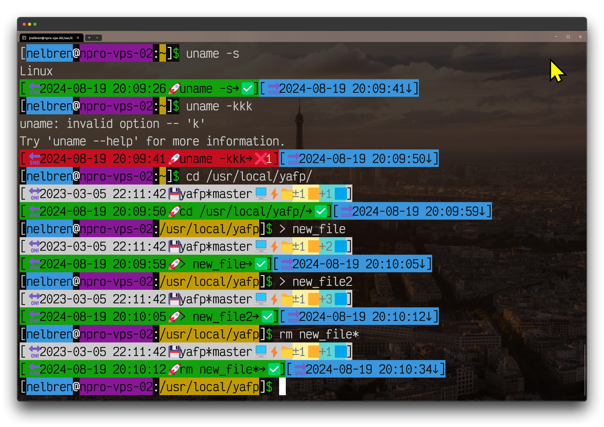

# :computer: Yet Another Fancy Prompt

[](https://www.gnu.org/software/bash/) [](https://docs.microsoft.com/powershell/) 

## :soon: Insert here the most beautiful screenshots

- ### :apple: macOS 

  

- ### :window: [Cygwin](https://www.cygwin.com/)

  

- ### :window: [Git Bash](https://git-scm.com/download/win)

  

- ### :penguin: Linux

  

- ### :window: [PowerShell](https://learn.microsoft.com/es-es/powershell/scripting/install/installing-powershell-on-windows?view=powershell-7.5)

  


## :art: Styles

### :bulb: Colors change according to:

- #### :green_book: **Developer**
  - ##### :necktie: root (**`#`**)
  - ##### :tshirt: normal user (**`$`**)
- #### :closed_book: **Production** 
  - ##### :necktie: root (**`#`**)
  - ##### :tshirt: normal user (**`$`**)

## :floppy_disk: Acquire

```bash
cd /usr/local
git clone https://github.com/nelbren/yafp.git
```

## :eyes: Preview

```bash
source /usr/local/yafp/yafp-ps1.bash
```

## :heavy_check_mark: Install

```bash
echo "source /usr/local/yafp/yafp-ps1.bash" | tee -a ~/.bashrc /etc/skel/.bashrc
```